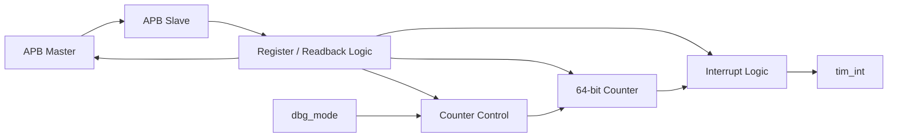

# APB Timer IP — RTL Design & Verification

A configurable **64-bit Timer IP** implemented in Verilog with an **APB slave interface**.

The design is inspired by the timer concept used in RISC-V CLINT and provides software-programmable counting, compare, interrupt, byte-access, error-handling, and debug-halt functionality.

This repository contains the RTL implementation, verification testbench, simulation scripts, waveform/coverage databases, and generated coverage reports.

---

## 1. Project Overview

The Timer IP is a memory-mapped peripheral controlled through an APB interface.

Its main purpose is to provide a programmable 64-bit timer that can:

- count at the system-clock rate or at a programmable interval;
- generate a timer interrupt when the counter reaches a programmed compare value;
- support software access to timer and compare registers;
- detect prohibited configuration writes;
- support byte-level register writes;
- halt and resume during debug mode while preserving the current counting phase.

The implementation corresponds to the **Advanced-level Timer IP** specification.

---

## 2. Main Features

- 64-bit count-up counter
- 12-bit APB address interface
- 32-bit APB data interface
- Active-low asynchronous reset
- APB slave interface
- One-cycle APB wait state
- APB byte-write support through `PSTRB`
- APB error response for prohibited accesses
- Programmable counting interval from 1 to 256 system-clock cycles
- Software-readable and writable 64-bit counter
- Programmable 64-bit compare value
- Hardware, maskable, level-sensitive timer interrupt
- Sticky interrupt-pending status
- Write-One-to-Clear (`W1C`) interrupt status
- Hardware counter clear when `timer_en` changes from `1` to `0`
- Debug halt/resume support
- Divider-phase preservation across debug halt
- Read-As-Zero / Write-Ignored (`RAZ/WI`) behavior for reserved addresses

---

## 3. Architecture

The Timer IP is organized into five major functional blocks:



### Functional blocks

**APB Slave**

Handles APB read/write transactions, generates internal read/write enables, inserts the required one-cycle wait state, and produces error responses for prohibited accesses.

**Register / Readback Logic**

Implements the memory-mapped control, data, compare, interrupt, and halt registers together with address decoding and the APB read-data multiplexer.

**Counter Control**

Determines when the 64-bit counter is allowed to increment according to:

- `timer_en`
- `div_en`
- `div_val`
- `dbg_mode`
- `halt_req`

**64-bit Counter**

Implements the timer value using two 32-bit registers:

```text
counter[63:0] = {TDR1, TDR0}
```

**Interrupt Logic**

Compares the 64-bit counter against the programmed 64-bit compare value and manages the interrupt-pending state and interrupt output.

---

## 4. Top-Level Interface

Top module:

```text
timer_top
```

| Signal | Width | Direction | Description |
|---|---:|---|---|
| `sys_clk` | 1 | Input | System clock |
| `sys_rst_n` | 1 | Input | Active-low asynchronous reset |
| `tim_psel` | 1 | Input | APB slave select |
| `tim_pwrite` | 1 | Input | APB transfer direction |
| `tim_penable` | 1 | Input | APB access-phase enable |
| `tim_paddr` | 12 | Input | APB address |
| `tim_pwdata` | 32 | Input | APB write data |
| `tim_prdata` | 32 | Output | APB read data |
| `tim_pstrb` | 4 | Input | APB byte-write strobe |
| `tim_pready` | 1 | Output | APB transfer completion |
| `tim_pslverr` | 1 | Output | APB slave error response |
| `tim_int` | 1 | Output | Timer interrupt |
| `dbg_mode` | 1 | Input | Debug-mode indication |

---

## 5. Register Map

The Timer IP implements eight memory-mapped registers.

| Offset | Register | Name | Function |
|---:|---|---|---|
| `0x00` | `TCR` | Timer Control Register | Timer enable and counting configuration |
| `0x04` | `TDR0` | Timer Data Register 0 | Counter bits `[31:0]` |
| `0x08` | `TDR1` | Timer Data Register 1 | Counter bits `[63:32]` |
| `0x0C` | `TCMP0` | Timer Compare Register 0 | Compare bits `[31:0]` |
| `0x10` | `TCMP1` | Timer Compare Register 1 | Compare bits `[63:32]` |
| `0x14` | `TIER` | Timer Interrupt Enable Register | Interrupt enable |
| `0x18` | `TISR` | Timer Interrupt Status Register | Interrupt pending / W1C status |
| `0x1C` | `THCSR` | Timer Halt Control Status Register | Debug halt request / acknowledge |
| Others | — | Reserved | Read-As-Zero / Write-Ignored |

---

## 6. Timer Control Register — TCR

Address:

```text
0x00
```

Reset value:

```text
0x0000_0100
```

Important fields:

```text
31                    12 11       8 7      2 1       0
+-----------------------+----------+---------+---+------+
|       Reserved        | div_val  | Reserved|DE | TE   |
+-----------------------+----------+---------+---+------+
```

### `timer_en` — bit 0

```text
0 : timer disabled
1 : timer enabled
```

When `timer_en` changes from `1` to `0`, the Advanced implementation automatically clears the 64-bit counter to zero.

### `div_en` — bit 1

```text
0 : normal counting mode
1 : programmable counting mode
```

### `div_val[3:0]` — bits 11:8

When programmable counting mode is enabled:

| `div_val` | Counting interval |
|---:|---:|
| `0` | 1 clock |
| `1` | 2 clocks |
| `2` | 4 clocks |
| `3` | 8 clocks |
| `4` | 16 clocks |
| `5` | 32 clocks |
| `6` | 64 clocks |
| `7` | 128 clocks |
| `8` | 256 clocks |
| `9–15` | Prohibited |

The divider control **does not generate a new clock**.

Instead, the design keeps using `sys_clk` and generates a counter-enable event at the programmed interval.

---

## 7. Counter Operation

### Normal mode

```text
timer_en = 1
div_en   = 0
```

The 64-bit counter increments once every system-clock cycle.

### Programmable mode

```text
timer_en = 1
div_en   = 1
```

The counter increments according to `div_val`.

For example:

```text
div_val = 2
```

produces one counter increment every:

```text
2^2 = 4 system-clock cycles
```

---

## 8. 64-bit Counter

The timer value is implemented using two 32-bit registers:

```text
TDR1 : upper 32 bits
TDR0 : lower 32 bits
```

Therefore:

```text
counter[63:0] = {TDR1, TDR0}
```

When the lower 32 bits overflow:

```text
TDR0 = 32'hFFFF_FFFF
```

the next count produces:

```text
TDR0 = 32'h0000_0000
TDR1 = TDR1 + 1
```

The complete 64-bit counter naturally wraps around after a 64-bit overflow.

The counter continues operating after both:

- an interrupt event;
- a counter overflow.

---

## 9. Software Counter Access

`TDR0` and `TDR1` are software-accessible registers.

Software may modify the counter value through APB writes.

After a software write, hardware counting continues from the newly programmed value.

The registers also support byte-level writes through:

```text
tim_pstrb[3:0]
```

Each strobe bit corresponds to one byte lane of the 32-bit register.

---

## 10. APB Byte Access

The Advanced implementation supports partial register writes through `PSTRB`.

```text
PSTRB = 4'b0001 -> bits  7:0
PSTRB = 4'b0010 -> bits 15:8
PSTRB = 4'b0100 -> bits 23:16
PSTRB = 4'b1000 -> bits 31:24
```

Only the selected byte lanes are updated during the corresponding APB write transaction.

---

## 11. APB Wait State

The APB slave introduces a **one-cycle wait state** before completing a transaction.

Conceptually:

```text
SETUP
PSEL = 1
PENABLE = 0

        |
        v

ACCESS
PSEL = 1
PENABLE = 1
PREADY = 0

        |
        | one wait cycle
        v

COMPLETE
PREADY = 1
```

Internal registered read/write enable signals are used to generate this behavior.

---

## 12. APB Error Handling

The Advanced design returns an APB error response through:

```text
tim_pslverr
```

for prohibited Timer Control Register accesses.

### Illegal divider value

The following values are prohibited:

```text
div_val = 9 ... 15
```

### Divider modification while timer is running

While:

```text
timer_en = 1
```

software is not allowed to change:

```text
div_en
div_val
```

If such an access occurs:

```text
tim_pslverr = 1
```

and the prohibited configuration update is rejected.

The error-detection logic compares the requested configuration against the currently stored TCR value to detect actual changes.

---

## 13. Counter Clear on Timer Disable

The design detects a falling edge of `timer_en`.

Conceptually:

```text
timer_en
   1 ---------
              \
               0
```

This generates an internal clear condition.

Both:

```text
TDR0
TDR1
```

are then reset to:

```text
0x0000_0000
```

without requiring software to clear them manually.

---

## 14. Timer Compare

The compare value is also 64 bits:

```text
compare[63:0] = {TCMP1, TCMP0}
```

where:

```text
TCMP0 = lower 32 bits
TCMP1 = upper 32 bits
```

Both compare registers are software programmable and support byte writes.

The interrupt condition occurs when:

```text
counter[63:0] == compare[63:0]
```

---

## 15. Timer Interrupt

The Timer IP implements a:

```text
hardware
maskable
level-sensitive
```

interrupt.

The design separates:

```text
interrupt pending status
```

from:

```text
interrupt output enable
```

The interrupt output is generated as:

```text
tim_int = int_en & int_st
```

where:

- `int_en` comes from `TIER`;
- `int_st` is the sticky interrupt-pending status in `TISR`.

---

## 16. Sticky Interrupt Pending Status

When:

```text
counter == compare
```

the interrupt status is set:

```text
int_st = 1
```

The counter continues counting after the match.

Even after the counter moves beyond the compare value:

```text
int_st
```

remains asserted until explicitly cleared.

This provides a **sticky pending status**, ensuring that software does not lose the timer event.

---

## 17. Write-One-to-Clear Interrupt Status

`TISR.int_st` uses **Write-One-to-Clear (`W1C`)** behavior.

When:

```text
int_st = 1
```

software clears it by writing:

```text
1
```

to the status bit.

Writing:

```text
0
```

has no effect.

If interrupt set and interrupt clear occur simultaneously, the **clear operation has higher priority**.

---

## 18. Interrupt Masking

Disabling the interrupt:

```text
int_en = 0
```

forces:

```text
tim_int = 0
```

but does **not** clear:

```text
int_st
```

Therefore the interrupt event remains pending even while the external interrupt output is masked.

---

## 19. Debug Halt / Resume

The timer supports halt operation during debug mode.

A halt occurs only when:

```text
dbg_mode = 1
halt_req = 1
```

When the request is accepted:

```text
halt_ack = 1
```

During the halt:

- the 64-bit counter stops;
- the internal divider-phase counter also stops.

When `halt_req` is cleared, the timer resumes operation.

### Divider-phase preservation

The divider state is preserved during halt.

For example, if the counter is configured to increment every four clocks and is halted halfway through the current interval, it resumes from the same divider phase instead of restarting the interval.

This maintains the configured counting period across debug halt/resume.

---

## 20. Reserved Address Behavior

All unimplemented addresses follow:

```text
RAZ/WI
```

meaning:

```text
Read-As-Zero
Write-Ignored
```

A read from a reserved address returns:

```text
32'h0000_0000
```

and writes to reserved addresses do not modify the Timer IP state.

---

## 21. Read Data Multiplexer

APB reads are selected according to the register address:

```text
0x00 -> TCR
0x04 -> TDR0
0x08 -> TDR1
0x0C -> TCMP0
0x10 -> TCMP1
0x14 -> TIER
0x18 -> TISR
0x1C -> THCSR
other -> 32'h0000_0000
```

The selected value is returned through:

```text
tim_prdata[31:0]
```

---

## 22. Verification

The project includes a Verilog verification environment used to verify the RTL behavior.

The verification scope covers the major functional areas of the Timer IP, including:

- reset behavior;
- APB register read/write access;
- APB one-cycle wait state;
- byte-write behavior;
- reserved-address behavior;
- prohibited TCR accesses;
- normal counter operation;
- programmable counting intervals;
- 32-bit carry propagation inside the 64-bit counter;
- software writes to the counter;
- hardware counter clear;
- compare operation;
- interrupt generation;
- interrupt masking;
- sticky interrupt status;
- W1C interrupt clearing;
- debug halt;
- debug resume;
- divider-phase preservation.

The repository also contains simulation and coverage artifacts generated during verification.

---

## 23. Repository Structure

```text
APB_Timer_IP/
|
├── rtl/
│   ├── apb_slave.v
│   ├── counter.v
│   ├── interrupt.v
│   ├── tcmp.v
│   ├── tcr.v
│   ├── thcsr.v
│   └── timer_top.v
│
├── tb/
│   └── test_bench.v
│
├── sim/
│   ├── coverage/
│   ├── covhtmlreport/
│   ├── work/
│   ├── compile.f
│   ├── exclude.do
│   ├── IP.ucdb
│   ├── Makefile
│   ├── modelsim.ini
│   ├── rtl.f
│   ├── tb.f
│   ├── test.log
│   ├── test.ucdb
│   ├── transcript
│   └── vsim.wlf
│
└── README.md
```

### RTL modules

| Module | Responsibility |
|---|---|
| `timer_top.v` | Top-level Timer IP integration |
| `apb_slave.v` | APB protocol handling, wait state, and error response |
| `tcr.v` | Timer configuration registers and timer-enable edge detection |
| `counter.v` | Counter-control logic and 64-bit counter |
| `tcmp.v` | 64-bit timer compare registers |
| `interrupt.v` | Interrupt pending, enable, W1C clear, and `tim_int` generation |
| `thcsr.v` | Debug halt request and acknowledge logic |

---

## 24. Simulation and Coverage

The project uses a Makefile-based simulation flow with ModelSim / QuestaSim.

The default testbench top module is:

```text
test_bench
```

The default test name is:

```text
test
```

### Build and Run

From the `sim/` directory:

```bash
cd sim
make all
```

This command:

1. creates the ModelSim/Questa `work` library;
2. compiles the RTL and testbench sources listed in `compile.f`;
3. runs the simulation in command-line mode until completion.

Equivalent commands:

```bash
make build
make run
```

---

### Run with Waveform

To build, simulate, and open the generated waveform:

```bash
make all_wave
```

The waveform can also be opened separately with:

```bash
make wave
```

The waveform database used by the Makefile is:

```text
vsim.wlf
```

The display radix can be overridden if required:

```bash
make RADIX=hex wave
```

The default radix is decimal.

---

### Run with Code Coverage

To compile and run the design with code coverage enabled:

```bash
make all_cov
```

This enables the following coverage categories through Questa/ModelSim:

```text
bcesft
```

and generates a UCDB coverage database for the simulation.

The coverage-enabled flow is equivalent to:

```bash
make build_cov
make run_cov
```

---

### Generate Text Coverage Reports

After running the coverage simulation:

```bash
make gen_cov
```

This merges the generated UCDB databases into:

```text
IP.ucdb
```

and generates:

```text
coverage/summary_report.txt
coverage/detail_report.txt
```

The summary report contains the overall coverage results, while the detail report contains uncovered code and coverage details.

---

### Generate HTML Coverage Report

To generate the HTML coverage report:

```bash
make gen_html
```

The resulting report can be opened in a browser for detailed coverage analysis.

---

### Run a Named Test

The test name can be overridden through `TESTNAME`.

Example:

```bash
make TESTNAME=counter_test all
```

For coverage:

```bash
make TESTNAME=counter_test all_cov
```

The corresponding simulation log and coverage database are generated using the selected test name.

---

### Clean Generated Simulation Files

To remove generated simulation artifacts:

```bash
make clean
```

This removes files such as:

```text
work/
*.ini
*.log
*.wlf
*.ucdb
transcript
```

---

### Available Make Targets

```text
make build      Compile the RTL and testbench
make run        Run the simulation
make all        Build and run the simulation
make all_wave   Build, run, and open waveform

make build_cov  Compile with coverage enabled
make run_cov    Run simulation with coverage enabled
make all_cov    Build and run with coverage enabled

make gen_cov    Generate merged UCDB and text coverage reports
make gen_html   Generate HTML coverage report

make wave       Open the waveform database
make clean      Remove generated simulation files
make help       Display available Makefile commands
```
---

## 25. Tools and Technologies

- Verilog HDL
- RTL Design
- AMBA APB
- Memory-mapped register design
- ModelSim / QuestaSim
- Verilog testbench
- Code coverage
- Makefile-based simulation flow

---

## 26. Key RTL / DV Concepts Demonstrated

This project demonstrates practical experience with:

- synthesizable RTL design;
- sequential and combinational logic;
- bus protocol implementation;
- memory-mapped peripheral design;
- register access policies;
- byte-write strobes;
- APB protocol timing;
- protocol error handling;
- hardware/software register interaction;
- 64-bit arithmetic using 32-bit registers;
- interrupt architecture;
- W1C registers;
- sticky status registers;
- debug halt control;
- counter-enable generation without creating a divided clock;
- self-contained Verilog verification;
- simulation debugging;
- waveform analysis;
- code-coverage analysis.

---

## 27. Design Notes

A few important implementation decisions:

### No generated clock

The programmable divider does not generate a new clock domain.

All sequential logic remains driven by:

```text
sys_clk
```

while an internal enable controls when the timer counter increments.

### Interrupt pending and interrupt output are separated

The interrupt event is stored in `int_st`, while `int_en` only controls whether that pending event is visible on `tim_int`.

### Debug halt preserves timing state

Both the counter and divider progression stop during debug halt, allowing the timer to resume from the exact previous counting phase.

### Illegal configuration updates are rejected

Invalid divider values and forbidden runtime divider changes generate an APB error instead of silently changing the timer configuration.

---

## 28. Project Status

- RTL architecture: completed
- RTL implementation: completed
- APB interface: completed
- Advanced timer features: completed
- Verification testbench: completed
- Simulation environment: completed
- Coverage environment: completed

---

## Author

**Truong Minh Tran**

Computer Engineering  
RTL Design & Verification Portfolio Project